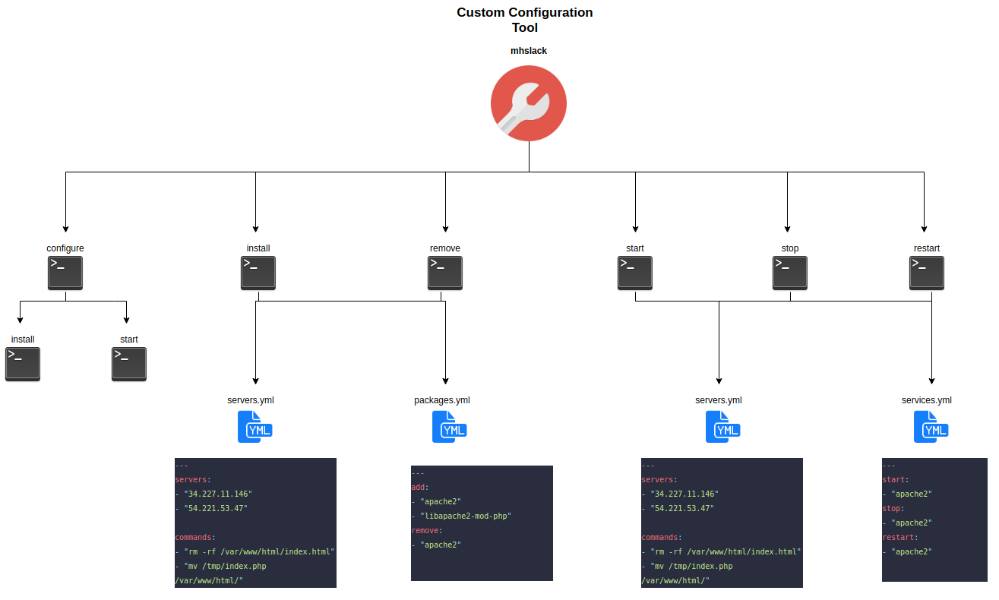
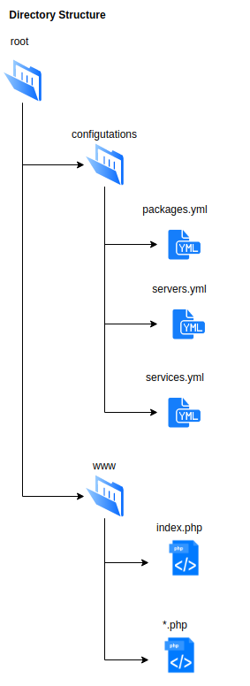

# mhslack - Configuration Tool

<!-- TABLE OF CONTENTS -->
<details open="open">
  <summary>Table of Contents</summary>
  <ol>
    <li>
      <a href="#about-the-tool">About The Tool</a>
      <ul>
        <li><a href="#built-with">Built With</a></li>
        <li><a href="#prerequisites">Prerequisites</a></li>
      </ul>
    </li>
    <li>
      <a href="#installation">Installation</a>
      <ul>
        <li><a href="#commands">Commands</a></li>
      </ul>
    </li>
    <li><a href="#architecture">Architecture</a></li>
    <li><a href="#directory-structure">Directory structure</a></li>
  </ol>
</details>


## About The Tool

This tool is developed as an assignment, which can be used to configure two EC2 instances only.
The tool, once installed, uses *.yml files for the configuration purpose. Details can be found in 'Directory Structure'

### Built With

This tool is built with python. The installation will install all the dependencies for the tool.

### Prerequisites

* Running ubuntu machine
* git [optional]


<!-- GETTING STARTED -->
## Installation

This tool can be installed using git or without. Please follow the steps
* ```git clone https://github.com/mandar-harkare/mhslack-tool.git ```
or
* ```wget -O mhslack-tool.zip https://github.com/mandar-harkare/mhslack-tool/archive/refs/heads/master.zip && unzip mhslack-tool.zip -d .```  
* ```cd mhslack-tool```
* Run ```./install.sh```
* Run ```mhslack version``` to check if the package was installed.
* Make sure the following environment variables are set to access the EC2s
    1. username
    2. password


### Commands
Following are the available commands for this version of mhslack
* ```mhslack version``` - to get mhslack version
* ```mhslack help``` - to get help
* ```mhslack configure``` - to configure the servers completely to run php files
* ```mhslack install``` - to install packages mentioned in ```packages.yml``` under ```add``` key on the servers 
* ```mhslack remove``` - to remove packages mentioned in ```packages.yml``` under ```remove``` key from the servers 
* ```mhslack start``` - to start services mentioned in ```services.yml``` under ```start``` key on the servers 
* ```mhslack stop``` - to stop services mentioned in ```services.yml``` under ```stop``` key on the servers 
* ```mhslack restart``` - to restart services mentioned in ```services.yml``` under ```restart``` key on the servers 


<!-- USAGE EXAMPLES -->
## Architecture


## Directory structure
```tool``` directory is just for installation, it can be removed after installation. Files and directories are self explainatory, but a brief idea
* ```configuration/packages.yml``` - This files has packages. Packages under ```add``` will be installed, and under ```remove``` will be removed
* ```configuration/servers.yml``` - This files has servers and additional commands to be executed on the servers alog with the configuration.
* ```configuration/services.yml``` - This files has services. Services under ```start``` will be started, under ```stop``` will be stopped and under ```restart``` will be restarted.
* ```www/*.php``` - All the php files under this directory will be deployed on the servers.



